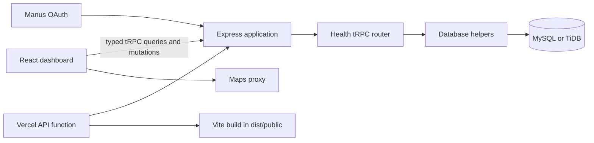

# LifeLink Blue

**LifeLink Blue** is a full-stack healthcare coordination demonstration application. It brings together blood-bank discovery, medicine availability, blood-reservation tracking, hospital-published transfusion and chemotherapy milestones, and caregiver coordination in a single clinical-dashboard experience.

> **Demonstration only.** This application contains representative data. It does not provide real-time clinical availability, diagnosis, treatment recommendations, or emergency services. Patients and caregivers must confirm clinical decisions, appointment details, and availability directly with the relevant provider.

## What the application includes

| Area                 | Included capability                                                                                                                              |
| -------------------- | ------------------------------------------------------------------------------------------------------------------------------------------------ |
| Blood discovery      | Searchable blood-bank inventory, blood-group filters, map markers, and external directions.                                                      |
| Medicine discovery   | Persistent medicine catalog, availability records, source filters, and provider contacts.                                                        |
| Reservations         | Blood reservation records with pending, accepted, and fulfilled lifecycle states.                                                                |
| Hospital care        | Hospital-published transfusion and chemotherapy status records with lifecycle filters.                                                           |
| Operations portal    | SQL-backed patient registration/login, hospital records, bed availability, ambulance requests, and role-scoped data operations at `/operations`. |
| Caregiver network    | Persisted caregiver profiles, consent links, shared updates, non-diagnostic coordination suggestions, and invitations.                           |
| Care journey         | Patient-scoped trace from an accepted blood reservation to a treatment status, caregiver update, and caregiver suggestion.                       |
| Guided demonstration | A seven-step experience covering profile, discovery, reservation, blood-bank acceptance, and alerts.                                             |
| Live dashboard       | India local date/time, time-aware greeting, and current representative reservation, treatment, and caregiver summary cards.                      |

## Technology

| Layer      | Implementation                                                                          |
| ---------- | --------------------------------------------------------------------------------------- |
| Client     | React 19, TypeScript, Vite, Tailwind CSS 4, React Query, Wouter, Lucide icons.          |
| Server     | Express 4 and tRPC 11 with typed procedures.                                            |
| Database   | MySQL/TiDB accessed through Drizzle ORM and generated SQL migrations.                   |
| Identity   | Manus OAuth session integration.                                                        |
| Maps       | Google Maps through the configured Maps proxy.                                          |
| Validation | Vitest unit and integration-oriented tests.                                             |
| Hosting    | Managed LifeLink hosting, or Vercel with a Vite static build plus serverless API entry. |

## Architecture



The client accesses application data through typed tRPC hooks rather than raw browser requests. The server exposes the health router and data helpers; Drizzle persists the application model in MySQL/TiDB. Local development starts an Express listener, while Vercel imports the same application configuration through `api/index.ts` as a serverless handler.

## Patient-centered data model

`patientProfiles` is the care-model anchor. A patient profile can belong to one application user and is referenced by reservations, treatment statuses, and caregiver consent links. This allows the representative workflow to be traced from `LL-RSV-2026-001` through `LL-TX-2026-001` to a caregiver shared update and the **Confirm collection requirements** coordination prompt.

| Relationship                                                         | Purpose                                                                          |
| -------------------------------------------------------------------- | -------------------------------------------------------------------------------- |
| `users → patientProfiles`                                            | Links an authenticated user to one canonical patient profile.                    |
| `patientProfiles → bloodReservations`                                | Scopes each reservation to the patient.                                          |
| `bloodReservations → hospitalTreatmentStatuses`                      | Optionally connects an accepted reservation to a transfusion status.             |
| `patientProfiles → patientCaregiverLinks`                            | Records consent and sharing level for a trusted caregiver.                       |
| `patientCaregiverLinks → caregiverSharedUpdates`                     | Scopes provider and reservation updates to a care-sharing relationship.          |
| `patientCaregiverLinks → caregiverSuggestions`                       | Scopes practical, non-diagnostic coordination suggestions.                       |
| `caregiverSharedUpdates` and `caregiverSuggestions → source records` | Maintains optional reservation, treatment, and medicine-availability provenance. |

The full entity-relationship diagram, foreign-key explanations, retention decisions, and workflow narrative are available in [`docs/database-relationships.md`](docs/database-relationships.md).

## Repository layout

```text
client/                 React dashboard and client-side utilities
  src/pages/Home.tsx    LifeLink dashboard views and interaction controller
  src/lib/              tRPC client, status view helpers, and focused tests
server/                 tRPC router and database helpers
  _core/app.ts          Reusable Express application configuration
  _core/index.ts        Local development and production listener
  routers/health.ts     Typed health-domain procedures
api/index.ts            Vercel serverless Express entry point
drizzle/                Schema, relations, and migrations
docs/                   Data-model and deployment documentation
vercel.json             Vercel static and API route configuration
```

## Local setup

Install Node.js 22 and pnpm, then install the project dependencies.

```bash
pnpm install --frozen-lockfile
```

Create your local environment through your secure secret-management workflow. Never commit credentials or database URLs to the repository.

| Variable                                                     | Purpose                                                             |
| ------------------------------------------------------------ | ------------------------------------------------------------------- |
| `DATABASE_URL`                                               | MySQL/TiDB connection string for Drizzle and the operations portal. |
| `JWT_SECRET`                                                 | Session signing secret; use at least 32 random characters.          |
| `OAUTH_SERVER_URL`                                           | OAuth service base URL.                                             |
| `VITE_APP_ID`                                                | Client OAuth application identifier.                                |
| `VITE_OAUTH_PORTAL_URL`                                      | OAuth portal URL used by the frontend.                              |
| `OWNER_OPEN_ID`, `OWNER_NAME`                                | Project owner identity metadata.                                    |
| `BUILT_IN_FORGE_API_URL`, `BUILT_IN_FORGE_API_KEY`           | Server-side integrated service configuration, when used.            |
| `VITE_FRONTEND_FORGE_API_URL`, `VITE_FRONTEND_FORGE_API_KEY` | Frontend integrated service configuration, when used.               |

Start the application locally with the following command.

```bash
pnpm dev
```

## Database workflow

Schema changes are defined in [`drizzle/schema.ts`](drizzle/schema.ts). Generate a migration after modifying the schema, inspect the resulting SQL, and apply it using the appropriate controlled database workflow. Existing data must be backfilled before non-null foreign keys are enforced.

```bash
pnpm drizzle-kit generate
```

The database schema includes locations, medicine sources, medicines, medicine availability, blood banks, component inventory, reservations, hospitals, treatment statuses, patient profiles, caregiver profiles, patient-caregiver links, shared updates, suggestions, and contact details. The operations portal adds portal accounts, registered patients, care hospitals, hospital beds, patient hospital records, ambulance providers, ambulance requests, and audit events in `drizzle/operationsSchema.ts`. Apply `database/lifelink_operations.sql` once before using `/operations`. Refer to the data-model documentation before changing relationships or deletion behavior.

## Quality checks

| Command      | Purpose                                               |
| ------------ | ----------------------------------------------------- |
| `pnpm check` | TypeScript type validation.                           |
| `pnpm test`  | Runs the Vitest suite.                                |
| `pnpm build` | Builds the Vite client and production Express bundle. |
| `pnpm dev`   | Starts the local full-stack development server.       |

The current automated coverage includes discovery queries, reservation and treatment lifecycle filters, caregiver network behavior, the care-journey trace, dashboard timeline utilities, and guided-demo controls.

## Deploying

### Managed hosting

The integrated managed hosting route is the simplest full-stack option because database access, OAuth, secrets, and project lifecycle controls are already connected. Create a project checkpoint and select **Publish** from the project interface.

### Vercel

LifeLink Blue includes a Vercel configuration that resolves the failure mode where backend JavaScript was served as page text. The configuration builds the Vite frontend into `dist/public`, sends `/api/*` to the Vercel serverless Express entry (`api/index.ts`), and routes browser navigation to the Vite entry page.

| Vercel setting   | Value                            |
| ---------------- | -------------------------------- |
| Framework Preset | `Other`                          |
| Install Command  | `pnpm install --frozen-lockfile` |
| Build Command    | `pnpm build`                     |
| Output Directory | `dist/public`                    |
| Node.js          | 22.x                             |

Configure the environment variables listed above in the Vercel project settings. Then update the OAuth redirect URL to `https://<your-vercel-domain>/api/oauth/callback` and redeploy. More detail is available in [`docs/vercel-deployment.md`](docs/vercel-deployment.md).

> A Vercel deployment needs a database that is reachable from Vercel and independent OAuth credentials. Do not use the development environment credentials in a production deployment.

## Privacy and clinical safeguards

The current public procedures support the representative unauthenticated demonstration. Before using real patient data, implement patient-scoped authorization, enforce caregiver consent and sharing levels, configure data-retention policies, add audit trails, and complete a privacy/security review appropriate for the deployment region.

Caregiver suggestions are intentionally practical prompts, such as confirming a collection requirement with a provider. They are not clinical diagnoses or treatment instructions.

## Production data-retention and patient privacy policy

> **Working policy — legal and clinical review required.** I am an AI, not a lawyer. This is an engineering baseline rather than formal legal advice. The operating organization must obtain qualified privacy, security, and healthcare-regulatory review before collecting real patient data, and must replace any period below that conflicts with applicable law, provider contracts, or a valid legal hold.

LifeLink Blue must operate as a **care-coordination application**, not an independent clinical system of record. It should collect only information required for the selected coordination purpose, keep it only for the approved period, and use a separate provider system for the authoritative medical record. This baseline follows the security-safeguard model described by the U.S. HIPAA Security Rule and the privacy principles reflected in GDPR Article 5; legal applicability depends on the organization, data, and deployment jurisdiction.[1] [2]

### Retention schedule and deletion rules

| Data category                                                                   | Production retention rule                                                                                                                                                                                                                       | Required disposition                                                                                                                                                                     |
| ------------------------------------------------------------------------------- | ----------------------------------------------------------------------------------------------------------------------------------------------------------------------------------------------------------------------------------------------- | ---------------------------------------------------------------------------------------------------------------------------------------------------------------------------------------- |
| Demonstration records                                                           | Use synthetic, clearly labeled records only. Reset with each demonstration release and delete within 30 days after the release is retired.                                                                                                      | Hard-delete synthetic records and associated media; never mix them with production patient data.                                                                                         |
| Authentication sessions and reset tokens                                        | Keep only while active; expire within 24 hours of inactivity and no later than 30 days after issue.                                                                                                                                             | Revoke immediately on logout, credential reset, suspected compromise, or account disablement.                                                                                            |
| Patient profile and contact data                                                | Retain while the account is active and the coordination relationship is active. On approved closure, begin deletion or de-identification within 30 days unless a documented legal, contractual, or patient-safety retention obligation applies. | Remove direct identifiers from operational tables and invalidate caregiver access. Preserve only the minimum non-identifying audit evidence required by the approved retention schedule. |
| Blood reservations, treatment-status events, and caregiver coordination updates | Retain as short-lived coordination data for 90 days after the related event is completed, cancelled, or expired. Do not use this period for statutory medical-record retention; provider records remain the source of truth.                    | Delete or irreversibly de-identify after 90 days unless an approved retention schedule, legal hold, incident investigation, or patient request requires otherwise.                       |
| Caregiver consent, sharing level, and revocation history                        | Retain while a caregiver link is active, plus 12 months after revocation or expiry to evidence consent administration.                                                                                                                          | Revoke access immediately. Retain the minimum consent-history fields, not copies of shared clinical content.                                                                             |
| Security and access audit events                                                | Retain 12 months, with role, action, record identifier, outcome, source IP/pseudonym, and timestamp. Audit events must avoid clinical narrative and direct identifiers wherever possible.                                                       | Restrict access to authorized security staff; purge after 12 months unless an active investigation or legal hold applies.                                                                |
| Encrypted backups                                                               | Retain a rolling maximum of 30 days. Backups must inherit the same access controls and deletion obligations as the source data.                                                                                                                 | Expire automatically; test restoration under controlled access and record the test outcome.                                                                                              |
| Application, analytics, and error logs                                          | Retain operational logs for 30 days. Never log credentials, session tokens, full names, contact details, treatment notes, or reservation payloads.                                                                                              | Redact at ingestion and purge automatically; investigate and remediate any accidental sensitive-data capture.                                                                            |

Every deletion, de-identification, export, retention exception, and legal hold must be recorded in an administrative audit trail. A legal hold pauses routine deletion only for the scoped records, includes a documented owner and review date, and is released promptly when the obligation ends.

### Required privacy and security safeguards

| Safeguard                   | Production requirement                                                                                                                                                                                                            |
| --------------------------- | --------------------------------------------------------------------------------------------------------------------------------------------------------------------------------------------------------------------------------- |
| Access control              | Replace public demonstration procedures with authenticated, patient-scoped procedures. Every request must verify that the user owns the patient profile or has an active, authorized clinical or caregiver relationship.          |
| Caregiver consent           | Permit sharing only through an active `patientCaregiverLinks` record. Enforce `sharingLevel`, display the scope of sharing to the patient, support immediate revocation, and deny access after revocation.                        |
| Minimum necessary data      | Collect only fields required for blood, medicine, appointment, or caregiver coordination. Do not add diagnosis narratives, attachments, government identifiers, or payment data unless separately assessed and justified.         |
| Encryption and secrets      | Require HTTPS in transit, encrypt production databases and backups at rest, keep all secrets in managed secret storage, and rotate credentials on a documented schedule and after suspected exposure.                             |
| Auditability                | Log access to patient-scoped records, consent changes, exports, deletions, and administrator actions. Protect audit logs from ordinary application users and review them for anomalous access.                                    |
| Data isolation              | Use row-level patient scoping in every database helper and tRPC procedure. Do not trust a client-supplied patient ID without confirming the authenticated actor's relationship.                                                   |
| Secure engineering          | Apply dependency updates, code review, least-privilege service accounts, rate limits, input validation, security tests, and periodic vulnerability assessment before and during production operation.                             |
| Vendor management           | Maintain a register of processors, hosting providers, analytics tools, map services, and support tools. Do not transmit patient-identifying data to a vendor until contractual, regional, and security requirements are approved. |
| Incident response           | Maintain an incident runbook for containment, investigation, evidence preservation, notification assessment, remediation, and post-incident review. Test the runbook at least annually.                                           |
| Patient rights and requests | Provide a documented process to verify and respond to access, correction, deletion, consent-revocation, and data-export requests within the applicable legal timeline.                                                            |

### Production release gate

The following conditions are mandatory before any real patient information is entered into LifeLink Blue.

| Release gate            | Evidence required                                                                                                                  |
| ----------------------- | ---------------------------------------------------------------------------------------------------------------------------------- |
| Authorization hardening | Tests proving patient, caregiver, clinician, and administrator access is denied unless explicitly permitted.                       |
| Consent controls        | A patient-visible sharing screen, granular sharing controls, revocation action, and audit event for every change.                  |
| Retention automation    | Scheduled deletion/de-identification jobs, backup-expiry controls, legal-hold workflow, and monitored job-failure alerts.          |
| Security review         | Threat model, dependency scan, penetration-test or equivalent assessment, secrets review, and remediation record.                  |
| Governance approval     | Named privacy owner, approved retention schedule, processor register, incident plan, and documented legal/clinical review.         |
| Operational readiness   | Restore test, access-log review procedure, on-call ownership, and staff training for handling patient-data requests and incidents. |

Until these controls are implemented and approved, keep the application limited to the existing representative demonstration data.

## References

[1] [U.S. Department of Health & Human Services, _The HIPAA Security Rule_](https://www.hhs.gov/hipaa/for-professionals/security/index.html)

[2] [EUR-Lex, _Regulation (EU) 2016/679 (General Data Protection Regulation)_](https://eur-lex.europa.eu/eli/reg/2016/679/oj/eng)

## License

This project is currently distributed under the **MIT** license as declared in [`package.json`](package.json).
